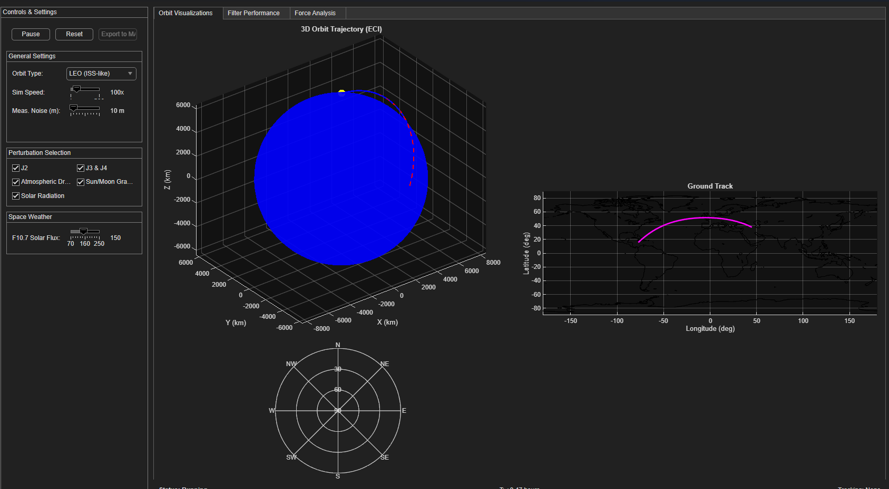
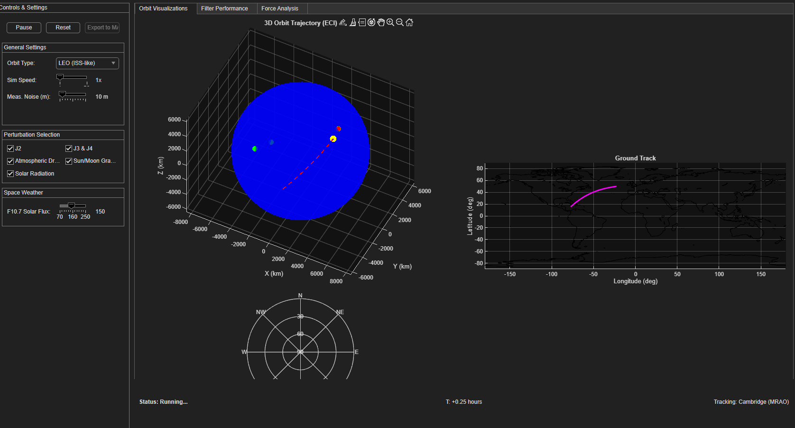
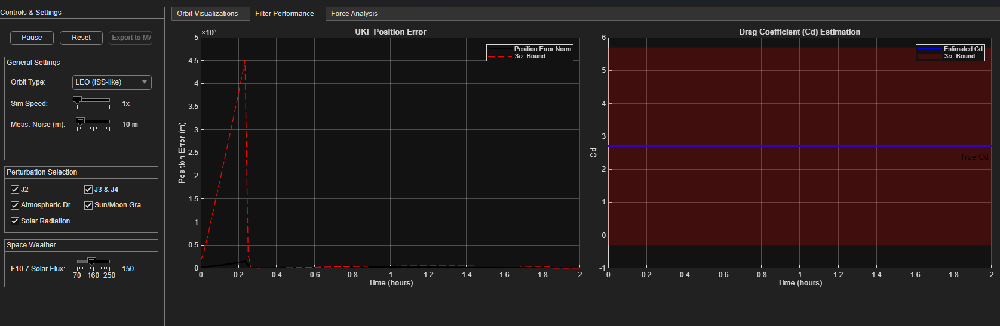
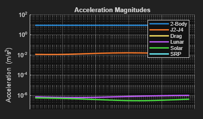

# Orbit Simulator

[](LICENSE)

A MATLAB-based orbital simulation and state estimation tool using Unscented Kalman Filtering for accurate spacecraft trajectory prediction and analysis. Made by Krystian Filipek.

<div align="center">







</div>

## Features

### Supported Orbit Types
- **LEO (Low Earth Orbit)** - ISS-like trajectories
- **MEO (Medium Earth Orbit)** - GPS constellation orbits
- **HEO (Highly Elliptical Orbit)** - Tundra orbits
- **GEO (Geostationary Orbit)** - Communication satellite orbits

### Perturbation Models
| Model | Description |
|-------|-------------|
| J2 Effects | Earth's oblateness perturbation |
| J3 & J4 Effects | Higher-order gravitational harmonics |
| Atmospheric Drag | Density-based resistance modeling |
| Third-body Gravity | Sun/Moon gravitational effects |
| Solar Radiation | Photon pressure modeling |

### Ground Station Network
```
- Cambridge (52.167°N, 0.039°W)
- Goldstone (35.4266°N, 116.8892°W)
- Canberra (35.4033°S, 148.9819°E)
```

</div>

The simulator provides comprehensive visualization tools including:
- Real-time 3D trajectory plotting
- Ground track visualization
- Sky plot for visibility analysis
- UKF error analysis charts
- Drag coefficient estimation plots
- Force magnitude breakdown

## Technical Implementation

The simulator implements:
- Unscented Kalman Filter for robust state estimation
- Complete orbital dynamics with major perturbations
- F10.7-based atmospheric density modeling
- Earth rotation and coordinate transforms
- Ground station measurement modeling

## Getting Started

1. Launch MATLAB
2. Navigate to the project directory
3. Run the main simulation:
   ```matlab
   run('orbit_sim.m')
   ```
4. Use the GUI controls to:
   - Select orbit type
   - Configure perturbations
   - Adjust space weather parameters
   - Control simulation flow

## Requirements

- Tested on Matlab R2025a
  - Aerospace Toolbox
  - Statistics and Machine Learning Toolbox
  - Mapping Toolbox

## Applications

I made this project to improve my understanding of:
- Orbital mechanics fundamentals
- Advanced Kalman filtering techniques
- Real-world space navigation challenges
- Ground station visibility analysis for Spaceflight society (Lander Project)

<div align="center">

Developed by [kfilipekk](https://github.com/kfilipekk)

</div>
